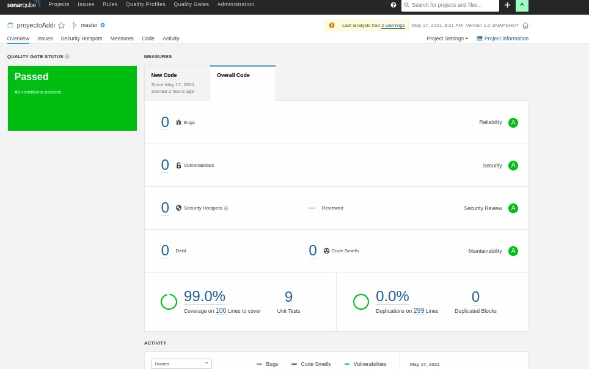

## Backend Prospect 
Proyecto creado para el proceso de seleccion de Addi, el cual consta de un sistema de prospectos CRM. 

## Java Version
La version de java que se va a utilizar es la 11.0.5 basada en el OpenJDK.

## decisions, assumptions or improvements

## 1. assumptions:
 tuve una dificultad al momento de definir las entradas del ProspectRatingClient.getProspectQualification ya que no era claro para mí que información se debería enviar para que el sistema de calificación pueda entregarnos un resultado.

## 1. decisions
En este caso decidí basarme en el documento que me enviaron, donde se especifica enviar los resultados de la ejecución de los sistemas anteriores.

## 2. assumptions
Tuve alguna dificultad al momento de definir las excepciones, debido a que no era claro si quien calculaba la calificacion era el arcargado de armar y evaluar cada uno de los casos anteriores.

## 2. decisions
Tome la decision que en cada capa ya sea repository o rest se encargara de manejar su exception, ya que era el conocia la existencia del objeto que se iba a devolver.

## Quality Project

